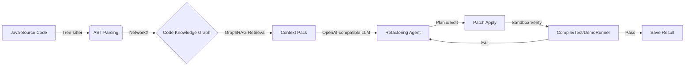

# RefactorGraph-Agent: Neuro-Symbolic Automated Refactoring via GraphRAG

[](https://opensource.org/licenses/MIT)
[](https://www.python.org/downloads/)

A research-oriented demo system for **safe, verifiable Java refactoring** using a **Lightweight Code Knowledge Graph + GraphRAG** and a **Plan → Edit → Verify/Repair** loop.

---

## What This Repo Implements (Highlights)

**RefactorGraph-Agent** focuses on *grounded* refactoring:

- **Lightweight Code Knowledge Graph (Tree-sitter + NetworkX)**  
  Builds a structural graph (classes/methods + call/inheritance edges) to reduce “lost-in-context” errors.

- **GraphRAG Context Pack (vector seeds → k-hop subgraph expansion)**  
  Retrieves a dependency neighborhood around the target method to provide *just enough* global context.

- **Plan → Edit → Verify/Repair loop (sandboxed, deterministic verification)**  
  Runs compilation/tests (auto-detected) in a sandbox and iterates with repair on failure.

- **Benchmark harness + ablation (GraphRAG vs vector-only)**  
  A reproducible runner that generates a JSON + HTML report for comparison experiments.

> This is a demo/prototype for research. It prioritizes interpretability + reproducibility over production completeness.

---

<!-- ## Why This Matters (Motivation)

LLM-based refactoring commonly fails in industrial codebases due to:

1. **Hallucinated references**: inventing methods/classes or misreading inheritance/call relations under limited context.
2. **Weak verification**: “looks correct” does not mean “compiles and preserves behavior”.

This project addresses both with **graph-grounded retrieval** (GraphRAG) and a **verification-driven agentic loop**. -->


## System Overview



### Key Components (Code Pointers)

- **Graph Builder**: `src/parser.py`, `src/graph_builder.py`  
- **GraphRAG Context Engine**: `src/context_engine.py`, `src/vector_index.py`, `src/retriever.py`  
- **Agent (Plan/Edit/Repair)**: `src/agent/agent.py`, prompts in `src/agent/prompts.py`  
- **Sandbox & command allowlist**: `src/agent/sandbox.py`  
- **Benchmark & report**: `demo_benchmark.py`, `src/eval/*`, outputs to `bench_out/*`

---

## Quick Start (Demo)

### Prerequisites
- Python 3.10+
- Java JDK 11+ (verification/compilation)

### Install
```bash
pip install -r requirements.txt
```

### 1) Build a GraphRAG context pack
```bash
python demo_context_pack.py \
  --project data/marketing-demo \
  --query "LegacyScoringUtil.calculateBaseScore" \
  --out context_pack.json
```

### 2) Run the refactoring agent
The agent reads configs from CLI or `.env`.

**Minimal example:**
```bash
python demo_refactor_agent.py \
  --project data/marketing-demo \
  --context-pack context_pack.json \
  --request "Refactor LegacyScoringUtil into a replaceable scoring service; keep DemoRunner output unchanged."
```

**Using an OpenAI-compatible endpoint via env:**
Configure your LLM key in `.env`

Edit the `.env` file in the repo root (or copy `.env.example` to `.env`) and fill in:

```bash
OPENAI_API_KEY=...
OPENAI_MODEL=gpt-4.1-mini
OPENAI_BASE_URL=https://api.openai.com
```

```bash
python demo_refactor_agent.py \
  --project data/marketing-demo \
  --context-pack context_pack.json \
  --request "..."
```

> Tip: `demo_refactor_agent.py` also supports `--dry-llm` to validate the pipeline without calling a real model.

### Verification behavior (important)
If `--verify-cmd` / `REFAC_VERIFY_CMDS` is not provided, the agent **auto-detects** a deterministic verification sequence:
- If `src/main/java/**/DemoRunner.java` exists → `javac` compile + run DemoRunner  
- Else if Maven/Gradle files exist → `mvn test` / `gradle test` fallback

---

## Benchmark (GraphRAG vs Vector-only)

Ablation benchmark on a small task set:

```bash
python demo_benchmark.py \
  --project data/marketing-demo \
  --tasks data/bench_tasks.json \
  --out bench_out \
  --modes graph_rag,vector_only
```

Outputs:
- `bench_out/benchmark_results.json`
- `bench_out/benchmark_report.html`
- `docs/README_REPORT.md`
- `docs/benchmark_dashboard.html`

---

## Results
- 📊 Interactive dashboard (GitHub Pages): https://xiaoying218.github.io/GraphRAG-Refactor-Agent/benchmark_dashboard.html
- 🧾 Detailed report (Markdown): docs/README_REPORT.md

## Current Status & Limitations

**What’s already supported**
- Graph-grounded retrieval (GraphRAG) with controllable hops / max nodes
- A verification-driven agent loop with sandbox + command allowlist
- A benchmark runner + HTML report generation

**Known limitations (today)**
- Behavior preservation relies on compilation + existing tests / demo runner.
- No automatic generation of characterization tests yet.
- No formal equivalence checking (semantic preservation is approximated).

---
## Roadmap / Future Work

### 1) Benchmarks & evaluation (next)
- Expand the task suite and report metrics beyond compilation (e.g., maintainability/complexity/coupling), plus systematic failure-mode analysis for semantic drift.

### 2) Test-in-the-loop acceptance (planned, opt-in)
- Add an optional acceptance mode that runs a provided JUnit suite (characterization tests / behavior snapshots) as the success criterion.
- Feed failing test outputs/stack traces into the repair loop (during `--max-iters`) to reduce silent behavioral change.

### 3) Guardrails & constraint-guided refactoring (mid-term)
- Move toward “generate under constraints”: encode structural/metric constraints as pre/post checks.
- Integrate compiler + tests + static analysis as verifier feedback; extend guardrails with security-oriented checks to avoid risky patterns.

### 4) Test–code co-evolution (longer-term)
- Auto-synthesize characterization tests before refactoring, and co-evolve tests + code to lock in behavior under weak test coverage (optionally infer intent/spec from traces/history). 


<!-- ## Roadmap / Future Work

### 1) Constraint-guided refactoring (toward formal guarantees)
- Encode structural/metric constraints into generation (e.g., pre/post conditions)
- Move from “generate then check” → “generate under constraints”

### 2) Acceptance-grade testing as a first-class evaluation channel (planned)
- Add an **optional acceptance mode** that evaluates refactoring success by running a provided **JUnit test suite** (characterization tests).
- Keep it **non-invasive**: default behavior stays unchanged; acceptance tests are enabled only via a flag/config.

### 3) Test-Code Co-evolution (longer-term)
- Automatically synthesize characterization tests before refactoring
- Co-evolve tests + code to lock in behavior and reduce regressions -->

---

## License
MIT
