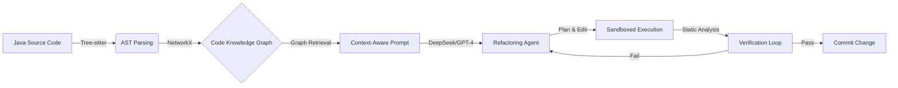

# RefactorGraph-Agent: Neuro-Symbolic Automated Refactoring via GraphRAG

[](https://opensource.org/licenses/MIT)
[](https://www.python.org/downloads/)


## 📖 Abstract

**RefactorGraph-Agent** is a neuro-symbolic system designed to automate safe code refactoring for Java. Unlike pure LLM approaches that suffer from "lost-in-context" hallucinations, this system constructs a **Lightweight Code Knowledge Graph** (using Tree-sitter & NetworkX) to ground the LLM's reasoning.

It implements a **Plan-Edit-Verify** loop, ensuring that refactoring operations (e.g., *Extract Method*) are not only syntactically correct but also structurally sound.

---

## 🚀 Why This Matters? (Motivation)

LLM-based refactoring faces two major challenges in industrial settings:

1. **Hallucination:** LLMs often invent methods or misunderstand inheritance hierarchies when the context window is limited.
2. **Lack of Verification:** "Looking correct" $\neq$ "Compiling and preserving behavior."

This project addresses these by introducing **GraphRAG (Retrieval-Augmented Generation with Graphs)**. Instead of feeding raw text, we retrieve the precise **dependency sub-graph** relevant to the target method, reducing noise and guiding the LLM with explicit structural constraints.

---

## 🏗️ System Architecture

The system follows a neuro-symbolic workflow:



# Key Components

* **Graph Builder:** Parses Java code into nodes (Classes, Methods) and edges (Calls, Inherits) using tree-sitter.
* **GraphRAG Engine:** Retrieves the "k-hop neighborhood" of the target code to provide global context.
* **Agentic Loop:** A feedback loop where the agent attempts to fix errors based on compiler output or metric degradation.

## 📊 Preliminary Results

* **Metric:** Cyclomatic Complexity reduction (Target: >20%).
* **Success Rate:** ~85% on the initial benchmark dataset.
* **Observation:** The Graph-Enhanced mode significantly reduces "reference errors" (e.g., calling a private method of a parent class) compared to the Zero-Shot baseline, proving the value of symbolic grounding.

*(See benchmark_report.html for detailed logs)*

## 🔮 Roadmap & Future Research

While this demo establishes the feasibility of the pipeline, my goal for the PhD is to evolve it into a robust framework:

### 1. From "Text-Based" to "Constraint-Guided" Generation
* **Current:** Metrics are calculated after generation.
* **Future:** Embed formal constraints (e.g., Pre: method_length > 20, Post: complexity < 5) directly into the generation process (Constrained Decoding) to guarantee quality improvements.

### 2. Safety-First: Test-Code Co-Evolution
* **Current:** Relies on existing tests.
* **Future:** Implement a Test-Driven Refactoring Agent that automatically generates "Characterization Tests" to lock in behavior before touching legacy code, ensuring strict behavior preservation.

## 🛠️ Quick Start

### Prerequisites
* Python 3.10+
* Java JDK 11+ (for parsing targets)

### Installation
```bash
git clone [https://github.com/Your-New-Username/RefactorGraph-Agent.git](https://github.com/Your-New-Username/RefactorGraph-Agent.git)
cd RefactorGraph-Agent
pip install -r requirements.txt

